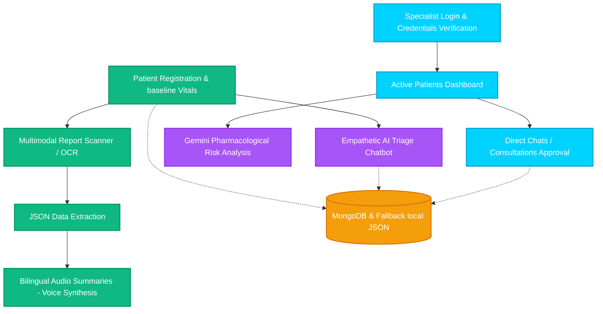

# 🌟 AI-DOCTOR: Advanced Clinical Network & Triage Workspace

A state-of-the-art, secure MERN medical dashboard designed to bridge the gap between patient diagnostics and professional clinical workflows. Powered by Gemini Multimodal LLMs, real-time speech synthesis, and interactive medical diagnostics.

---

## 🚀 Interactive Application Workflow



---

## ✨ Features

### 🩺 Patient Workspace
*   **🏥 Sympathetic Triage Bot**: A conversational interface that assesses patient symptoms in real-time, displaying dynamic color-coded urgency classifications (Low, Medium, or Emergency High).
*   **📑 Multimodal Lab Report Scanner**: Upload prescription images (PNG, JPG) or paste OCR text. The AI extracts structured medical JSON variables, including diagnosed conditions, medications, dosages, and abnormal lab indicators.
*   **🔊 Bilingual Voice Translator & Synthesis**: Instantly compiles complex report details into plain English and Hindi summaries. Includes interactive speed rates and dynamic audio playbacks.
*   **📈 Demographics & Vitals Timeline**: Manage profiles with baseline details and add monthly logs to generate real-time vitals graphs dynamically inside the user panel.

### 🥼 Doctor Specialist Workspace
*   **👥 Active Patient Catalog**: Visualizes patient status with dynamic risk-category colors, latest vital entries (BP & blood sugar), and medical histories.
*   **🛡️ Gemini Clinical Risk Assessment**: Runs multi-factor risk analyses on patient reports and logs using Gemini LLMs to output comprehensive risk sheets.
*   **💬 Live Consultation Rooms**: Review, approve, and chat directly with patients via real-time message streams.
*   **🔔 In-App Notifications**: Alerts the specialist of new patient consultation requests.

---

## 🎨 Visual Design Aesthetics
*   **Glassmorphic Design**: Curated color schemes tailored to roles (Vibrant Teal for patients, Cyber Cyan for doctors) over sleek, frosted dark interfaces with subtle glow backgrounds.
*   **Responsive Flow Layouts**: Adapts to various viewport sizes using double-column models and clean grids.
*   **Interactive Micro-Animations**: Smooth hover-states, dynamic pulsing status dots, audio soundwaves, and interactive graph points that render on hover.

---

## 🛠️ Technology Stack
*   **Frontend**: React.js, Vite, Chart.js, HTML5 canvas, Vanilla CSS.
*   **Backend**: Node.js, Express.js.
*   **Database**: MongoDB (Mongoose schemas) with auto-switching local file fallback storage.
*   **AI Engine**: Gemini Multi-Modal APIs.
*   **Audio Core**: HTML5 Web Speech Synthesis API.

---

## ⚙️ Development Setup

### 1. Prerequisites
Ensure you have Node.js installed on your machine.

### 2. Installation
Install core packages in the root, frontend, and backend directories:
```bash
# Root setup
npm install

# Backend setup
cd backend && npm install

# Frontend setup
cd ../frontend && npm install
```

### 3. Environment Setup
Configure your API keys. Create a `.env` file in the root or `backend` folder:
```env
PORT=5000
MONGODB_URI=your_mongodb_connection_string
GEMINI_API_KEY=your_gemini_api_key_here
```

### 4. Running the Servers
Start both the React development environment and Express backend concurrently:
```bash
# From root directory
npm run dev
```
-   **Frontend Client**: http://localhost:5173
-   **Backend REST Server**: http://localhost:5000

---

## 📊 Live Vitals Plotting Logic
Monthly vital entries logged via the patient edit profile update endpoints automatically populate two metrics:
1.  **Blood Pressure (mmHg)**: Charted on the left Y-axis.
2.  **Blood Sugar (mg/dL)**: Charted on the right Y-axis.

Whenever new vital arrays are saved, the risk levels are recalculated dynamically:
*   🔴 **High Risk**: Systolic BP $\ge$ 140 mmHg OR Sugar $\ge$ 180 mg/dL.
*   🟡 **Medium Risk**: Systolic BP $\ge$ 130 mmHg OR Sugar $\ge$ 120 mg/dL.
*   🟢 **Low Risk**: Standard vital thresholds.

---

## official platform website
https://ai-doctor-1fy2.onrender.com

## 🔒 License & Configuration
© 2026 AI-DOCTOR Secure Medical Network. All rights reserved.
Developer : YOGESH SWAMI
